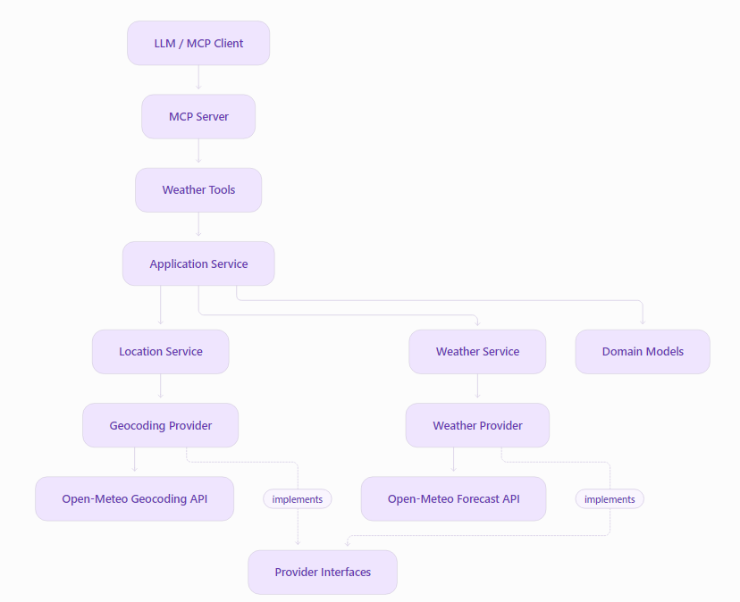
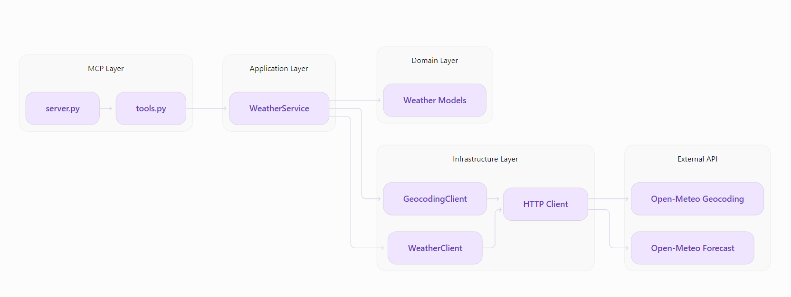
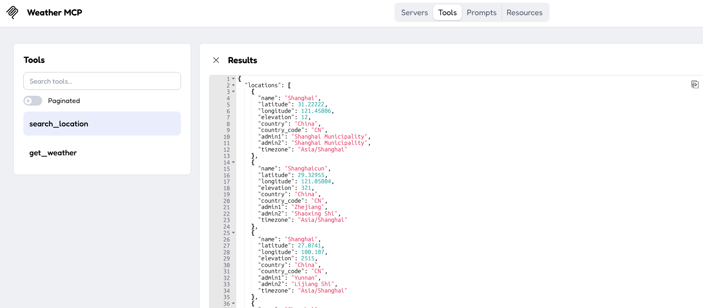
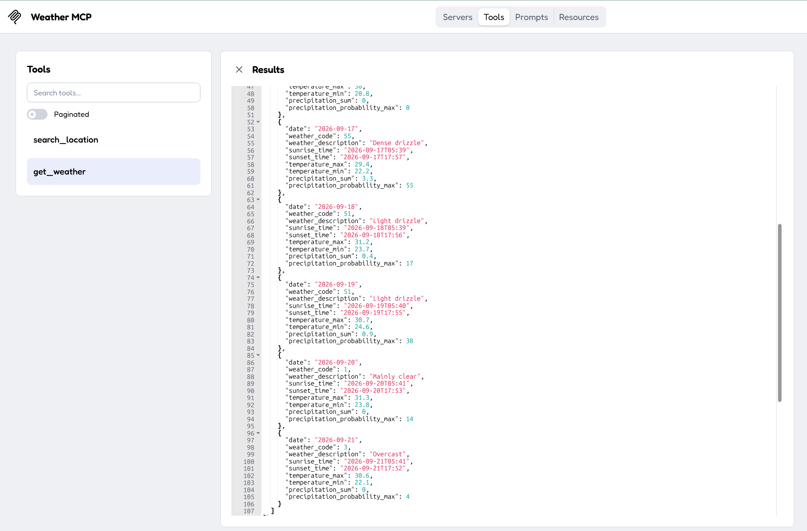
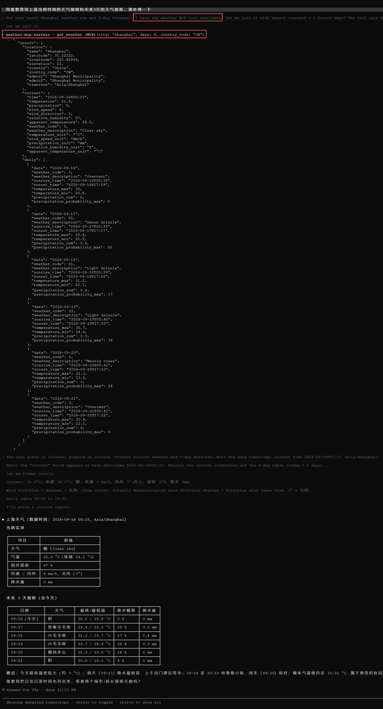

# 1.项目结构

&emsp; &emsp; 整体项目结构如下所示：

```bash
$ tree -L 3 .
.
|-- README.md
|-- docs
|   `-- images
|       |-- 01-获取位置信息.png
|       `-- 02-获取天气预报信息.png
|-- pyproject.toml
|-- src
|   |-- mcp_server.py
|   `-- weather_mcp
|       |-- __init__.py
|       |-- bootstrap.py
|       |-- clients
|       |-- config.py
|       |-- models
|       |-- providers
|       |-- services
|       `-- tools
|-- tests
|   |-- integration
|   |   `-- test_open_meteo.py
|   `-- unit
|       `-- test_weather_service.py
`-- uv.lock
```

> `src`：用于存放源码，MCP Server核心在这里面
> `test`: 用于存放测试代码

&emsp; &emsp; 项目架构图如下所示：



&emsp; &emsp; 各模块之间的依赖关系如下所示：



# 2.运行
&emsp; &emsp; 使用 MCP Inspector 运行效果，运行命令如下所示：

```bash
uv run mcp dev src/mcp_server.py 
```

&emsp; &emsp; 运行效果如下所示：

- 获取位置信息



- 获取天气预报信息



# 3.测试

&emsp; &emsp; 直接运行代码即可，执行以下命令

```bash
$ uv run pytest
=================================== test session starts =================================== 
platform win32 -- Python 3.14.7, pytest-9.1.1, pluggy-1.6.0
rootdir: C:\Users\mcp-servers-in-actions\weather-mcp-servers
configfile: pyproject.toml
plugins: anyio-4.15.1, asyncio-1.4.0
asyncio: mode=Mode.AUTO, debug=False, asyncio_default_fixture_loop_scope=None, asyncio_default_test_loop_scope=function
collected 2 items                                                                                                                                                                                                

tests\integration\test_open_meteo.py .                                     [ 50%]
tests\unit\test_weather_service.py .                                       [100%]

===================================  2 passed in 2.19s =================================== 
```

# 4.与Agent结合使用

&emsp; &emsp; 这里以Claude Code为例

- 1.启动MCP Server，执行命令

```bash
uv run src/mcp_server.py 
```

- 2.将MCP Server添加至Claude Code

```bash
# 添加 HTTP方式的 MCP
claude mcp add --transport http weather-mcp-servers http://127.0.0.1:20149/mcp
# 查看 MCP 列表
claude mcp list
weather-mcp-servers: http://127.0.0.1:20149/mcp (HTTP) - ✔ Connected
```

- 3.调用MCP Server



